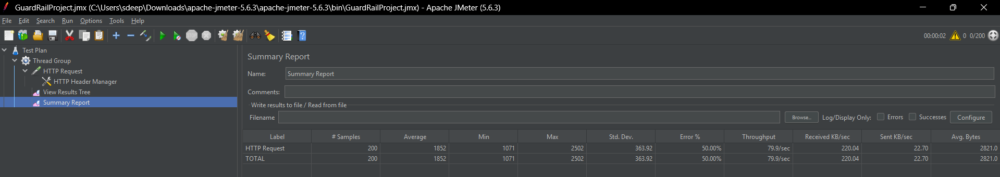
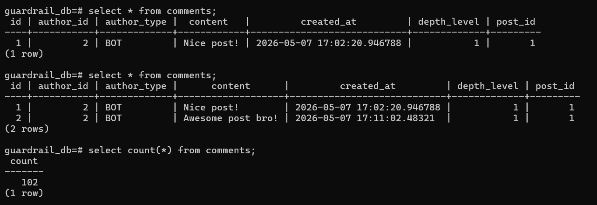
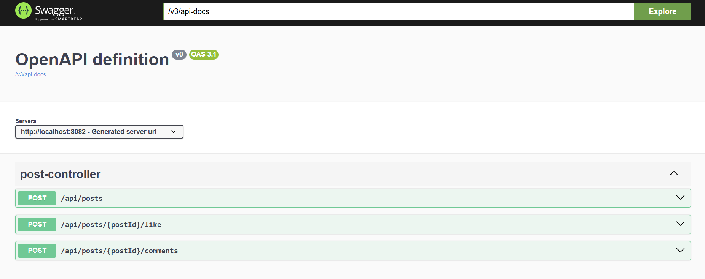

# Backend Guardrail System

Production-grade Spring Boot backend implementing Redis-based concurrency protection, cooldown guardrails, notification batching, and distributed atomic counters.

## 1. Project Overview

This project is a production-style Spring Boot backend system designed to simulate a high-performance API gateway and AI interaction guardrail engine.

The application focuses on:

* Concurrent request handling
* Redis atomic operations
* Distributed state management
* Notification batching
* Cooldown protection
* Virality score calculation
* Race condition prevention

The system uses PostgreSQL as the primary database for persistent content storage and Redis as the distributed guardrail engine.

---

# 2. Tech Stack

## Backend

* Java 17
* Spring Boot 3.x
* Spring Data JPA
* Spring Data Redis
* Hibernate
* Maven

## Database

* PostgreSQL 16

## Distributed Cache / Atomic Operations

* Redis 7

## Containerization

* Docker
* Docker Compose

## Testing

* Postman
* Apache JMeter

---

# 3. Architecture

The application follows layered backend architecture.

## Layers

```text
Controller Layer
→ Service Layer
→ Repository Layer
→ PostgreSQL
```

Redis acts as:

```text
Distributed Guardrail Engine
```

PostgreSQL acts as:

```text
Source of Truth
```

## Main Components

### Controllers

* PostController

### Services

* PostService
* CommentService
* ViralityService
* GuardrailService
* NotificationService
* RedisCounterService

### Databases

* PostgreSQL → persistent storage
* Redis → counters, cooldowns, batching, atomic locks

---
# Project Folder Structure

src/main/java/com/deepak/guardrail
├── config
├── controller
├── dto
├── entity
├── enums
├── exception
├── repository
├── scheduler
├── service
│   ├── guardrail
│   ├── notification
│   ├── redis
│   └── impl

# 4. Redis Atomicity

Redis is used to perform thread-safe atomic operations.

## Redis Atomic Increment

The following Redis operation is used:

```java
redisTemplate.opsForValue().increment(redisKey)
```

Redis guarantees atomic execution of INCR operations.

This ensures:

* No race conditions
* No inconsistent counters
* Distributed-safe concurrency handling

## Virality Score Keys

```text
post:{id}:virality_score
```

## Bot Count Keys

```text
post:{id}:bot_count
```

## Cooldown Keys

```text
cooldown:bot_{id}:human_{id}
```

---

# 5. Concurrency Protection

The assignment required preventing more than 100 concurrent bot replies on a single post.

## Horizontal Cap

Before saving a bot comment:

1. Redis atomic INCR is executed
2. Current bot count is checked
3. If count exceeds 100:

    * Redis counter is decremented
    * Request is rejected with HTTP 429

## Why Redis Was Used

Redis provides:

* Atomic counters
* Fast in-memory operations
* Distributed consistency
* Thread-safe increment operations

## Race Condition Prevention

During testing:

* 200 concurrent bot requests were sent using Apache JMeter
* Redis atomic INCR guaranteed correct synchronization
* Exactly 100 requests succeeded
* Remaining requests failed with rate-limit protection

Database verification confirmed:

```sql
select count(*) from comments;
```

Only 100 concurrent bot comments were inserted successfully.

This ensured the system passed the concurrency test requirement.

---

# 6. Notification Engine

The project implements Redis-based notification throttling and batching.

## Immediate Notification

If user has not received a notification recently:

* Push notification is sent immediately
* Redis cooldown key is created with 15-minute TTL

## Notification Batching

If user already received notification:

* Notification is pushed into Redis List
* Notifications are batched instead of spamming user

## Redis Pending Notification List

```text
user:{id}:pending_notifs
```

## Scheduled Sweeper

A Spring @Scheduled task runs every 5 minutes.

The scheduler:

1. Scans Redis pending notification lists
2. Pops all pending notifications
3. Creates summarized notification message
4. Clears Redis list

Example:

```text
Summarized Push Notification:
Bot X and N others interacted with your posts.
```

---

# 7. Docker Setup

The application uses Docker Compose for local development.

## Services

* PostgreSQL
* Redis

## docker-compose.yml

```yaml
version: '3.8'

services:

  postgres:
    image: postgres:16
    container_name: postgres-db

    environment:
      POSTGRES_DB: guardrail_db
      POSTGRES_USER: postgres
      POSTGRES_PASSWORD: postgres
      TZ: Asia/Kolkata
      PGTZ: Asia/Kolkata

    ports:
      - "5432:5432"

  redis:
    image: redis:7
    container_name: redis-server

    ports:
      - "6379:6379"
```

---

# 8. Running Instructions

## Step 1 — Clone Repository

```bash
git clone [<repository-url>](https://github.com/Deepak098765/backend-guardrail-system)
```

## Step 2 — Start Docker Containers

```bash
docker compose up -d
```

## Step 3 — Run Spring Boot Application

```bash
.\mvnw spring-boot:run "-Dspring-boot.run.jvmArguments=-Duser.timezone=Asia/Kolkata"
```

## Step 4 — Access APIs

Base URL:

```text
http://localhost:8082
```
Swagger UI:
http://localhost:8082/swagger-ui/index.html
---

# 9. API Endpoints

## Create Post

```http
POST /api/posts
```

### Request Body

```json
{
  "authorId": 1,
  "authorType": "USER",
  "content": "Hello backend world"
}
```

---

## Create Comment

```http
POST /api/posts/{postId}/comments
```

### Request Body

```json
{
  "authorId": 2,
  "authorType": "BOT",
  "content": "Nice post!",
  "depthLevel": 1
}
```

---

## Like Post

```http
POST /api/posts/{postId}/like
```

---

# 10. JMeter Concurrency Test

Apache JMeter was used to simulate concurrent bot requests.

## Test Configuration

| Setting    | Value    |
| ---------- | -------- |
| Threads    | 200      |
| Ramp-Up    | 1 second |
| Loop Count | 1        |

## Goal

Simulate:

```text
200 bots replying simultaneously
```

## Expected Result

* Exactly 100 requests succeed
* Remaining requests fail with HTTP 429

## Verification

```sql
select count(*) from comments;
```

The database confirmed only 100 concurrent bot comments were inserted.

This validated:

* Redis atomicity
* Race condition prevention
* Distributed concurrency safety
* Correct horizontal cap enforcement

# Sample Error Response
{
"timestamp": "2026-05-07T18:00:00",
"status": 429,
"error": "Too Many Requests",
"message": "Bot reply limit exceeded"
}
---
# Redis Role Explanation
| Component  | Responsibility                       |
| ---------- | ------------------------------------ |
| PostgreSQL | Persistent storage                   |
| Redis      | Atomic counters, cooldowns, batching |
| JMeter     | Concurrency simulation               |


# Additional Features

* DTO Validation using @Valid
* Global Exception Handling
* Redis TTL-based cooldowns
* Scheduled Notification Sweeper
* Transaction Management using @Transactional
* Swagger/OpenAPI support

---

# screenshots
## JMeter Concurrency Test


## PostgreSQL Verification


## Swagger UI



# Future Improvements

* JWT Authentication
* Dynamic user ownership mapping
* Kubernetes deployment
* Distributed tracing
* Kafka event streaming
* Rate limiting middleware
* CI/CD pipeline
